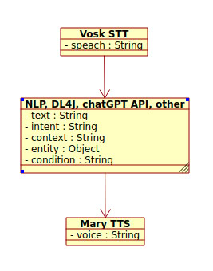

# El proyecto: java-neural-network-dl4j

Yo como Arquitectador =) pinté esta eschema UML para mejor entender el proyecto con su lógica.

## Mi asistente de voz

Mi asistente de voz es una aplicación que convierte voz en texto y genera respuestas inteligentes utilizando NLP.

Mi asistente de voz con su propia lógica analiza el texto de entrada (a través del micrófono), detecta la intención del usuario y genera una respuesta inteligente usando NLP (procesamiento de lenguaje natural).

Puede responder y emitir señales por voz, por ejemplo, en <b>operaciones financieras</b> de un banco, para facilitar la toma oportuna de decisiones en distintas situaciones. Se trata de indicaciones o <b>alertas por voz</b>, generadas de acuerdo con la lógica utilizada en el <b>sector financiero</b>, en el <b>ámbito bancario</b> o según las normativas del <b>Banco de España</b>.

    
    

Este asistente puede hablar con voz, como en un vagón de metro: “Atención, se cierran las puertas”. 😄

